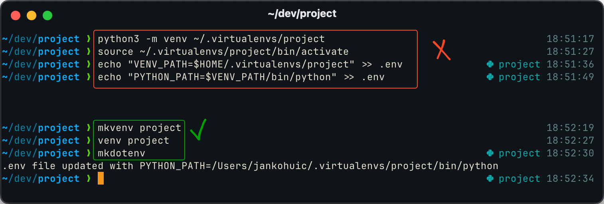

# Git Add X

### Usage:

#### - source the gcx.sh file in .zshrc / .bashrc

#### - use _gax_ followed by a single argument

#### - grep matches (case insensitive) under the hood

#### - works with a single file or more (e.g. _gax .py_)

# Venv Wrapper 
## Based on https://gist.github.com/benlubas/5b5e38ae27d9bb8b5c756d8371e238e6

#### - Set of bash functions to simplify venv management
#### - Source in ~/.zshrc / .bashrc
